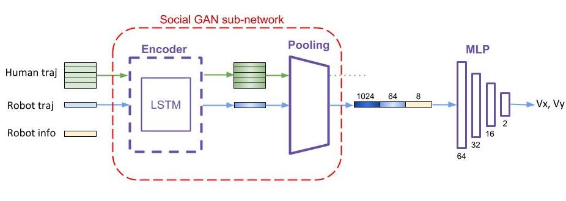

# TLSGAN
This repository contains the codes for my Master semester project at EPFL (Ecole Polytechnique Fédérale de Lausanne) under the supervision of Liu YueJiang and Alexandre Alahi. 

The implementation was built on the following projects:

- ICRA simulator and implementation
[Crowd-Robot Interaction: Crowd-aware Robot Navigation with Attention-based Deep Reinforcement Learning](https://arxiv.org/abs/1809.08835)
- Social GAN trajectory predictor [Social GAN: Socially Acceptable Trajectories with Generative Adversarial Networks] (https://arxiv.org/pdf/1803.10892.pdf). 

The git of both projects can be found here: [ICRA](https://github.com/vita-epfl/CrowdNav) and [Social GAN] (https://github.com/agrimgupta92/sgan).

## Method Overview
TLSGAN (Transfer Learning with Social GAN) puts forth the benefits of Transfer Learning under the crowd navigation problem.

A Social GAN trajectory predictor `sgan` is trained on a dataset generated on the ICRA simulator gym environment `crowd_sim.py`. The model is saved with a checkpoint.

The encoder and pooling layer are then augmented into a larger model for Reinforcement Learning training in `crowd_nav`.


In the config files, notably `policy.config`, different training methods can be chosen to study training with random sub-network initialisation, pretrained weights intialization, or even training with frozen sub-network weights.


## Setup
1. Install [Python-RVO2](https://github.com/sybrenstuvel/Python-RVO2) library
2. Install crowd_sim and crowd_nav into pip
```
pip install -e .
```

For Social GAN:
Go to `sgan` folder and run
```
pip install -r requirements.txt
```


## Getting started
This repository are organized in three parts: `crowd_sim` folder contains the simulation environment, 
`crowd_nav` folder contains codes for training and testing the policies, and `sgan` contains the code for training the Social GAN model. Details of the simulation framework can be found
[here](crowd_sim/README.md). 

Generating trajectories

1. In `crowd_nav`, generate trajectories
```
python generate_traj.py --num_sims 1000 --max_humans 7 --min_humans 4
```
2. Copy the `dataset_generation` folder to the `datasets` folder in `sgan`

Train trajectory prediction model

1. Train a model
```
python train.py --dataset_name dataset_generation --delim space --gpu_num 0 --l2_loss_weight 1 --restore_from_checkpoint 0
```
2. You can run a hyperparamter search with `hyperparameter_search.py`

Run the TLSGAN training

1. In the `crowd_nav` folder, train the model
```
python train_sgan.py --debug --gpu
```
The output is by default put in the data folder. You can find the used configs, the output logs, the learning curve, and the training and validation loss numpy arrays.


## Simulation Videos
CADRL             | LSTM-RL
:-------------------------:|:-------------------------:
|
SARL             |  OM-SARL
|


## Learning Curve
Learning curve comparison between different methods in invisible setting.


